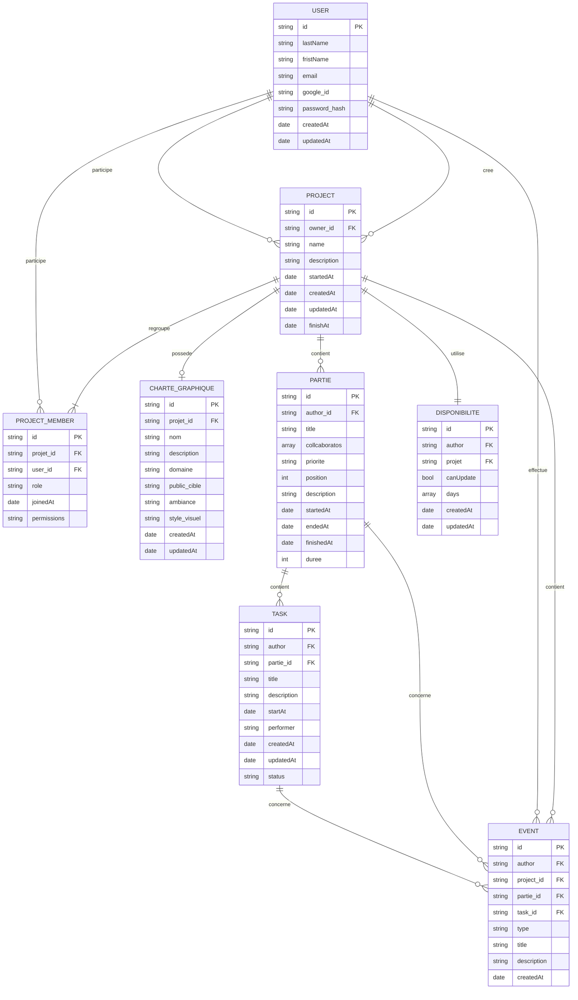

```mermaid

erDiagram
    USER {
        string id PK
        string lastName
        string fristName
        string email
        string google_id 
        string password_hash
        date createdAt
        date updatedAt
    }

    PROJECT {
        string id PK
        string owner_id FK
        string name
        string description
        date startedAt
        date createdAt
        date updatedAt
        date finishAt
    }

    PROJECT_MEMBER {
        string id PK
        string projet_id FK
        string user_id FK
        string role
        date joinedAt
        string permissions
    }


    CHARTE_GRAPHIQUE {
        string id PK
        string projet_id FK
        string nom
        string description
        string domaine
        string public_cible
        string ambiance
        string style_visuel
        date createdAt
        date updatedAt
    }

    EVENT {
        string id PK
        string author FK
        string project_id FK
        string partie_id FK
        string task_id FK
        string type
        string title
        string description
        date createdAt
    }

    PARTIE {
        string id PK
        string author_id FK
        string title
        array collcaboratos
        string priorite
        int position
        string description
        date startedAt
        date endedAt
        date finishedAt
        int duree
    }

    TASK {
        string id PK
        string author FK
        string partie_id FK
        string title
        string description
        date startAt
        string performer
        date createdAt
        date updatedAt
        string status
    }

    DISPONIBILITE {
        string id PK
        string author FK
        string projet FK
        bool canUpdate
        array days
        date createdAt
        date updatedAt
    }

    USER ||--o{ PROJECT : cree
    USER ||--o{ PROJECT : participe
    PROJECT ||--o| CHARTE_GRAPHIQUE : possede
    PROJECT ||--|| DISPONIBILITE : utilise
    PROJECT ||--|{ PROJECT_MEMBER : regroupe
    PROJECT ||--o{ EVENT : contient
    PROJECT ||--o{ PARTIE : contient
    USER ||--o{ EVENT : effectue
    PARTIE ||--o{ EVENT : concerne
    TASK ||--o{ EVENT : concerne
    USER ||--o{PROJECT_MEMBER: participe
    PARTIE ||--o{ TASK : contient
```

    

