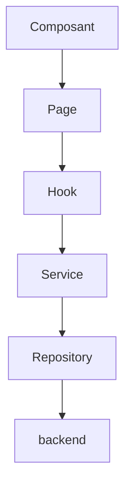
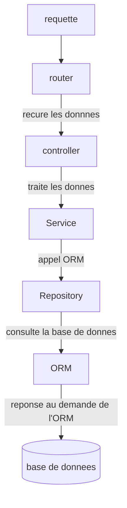

# architecture du projet

## 1. architecture frontend

```mermaid
    flowchart TD
        COMP[Composant] -->PAGE[Page]
        PAGE --> HOOK[Hook]
        HOOK --> SERV[Service]
        SERV --> REPO[Repository]
        REPO --> BACK[backend]
```

## 2. architecture backend

```mermaid
    flowchart TD
        COMP[requette] -->PAGE[router]
        PAGE --> |recure les donnnes|HOOK[controller]
        HOOK --> |traite les donnes|SERV[Service]
        SERV --> |appel ORM|REPO[Repository]
        REPO --> |consulte la base de donnes|ORM[ORM]
        ORM -->  |reponse au demande de l'ORM|DB[(base de donnees)]

```

